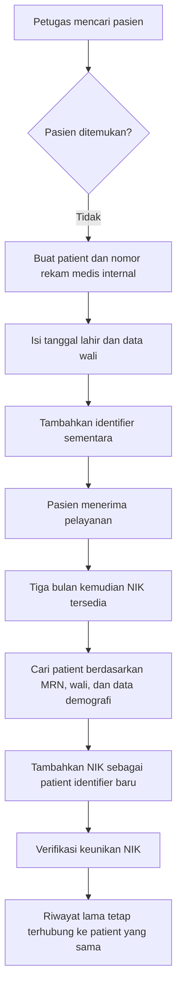
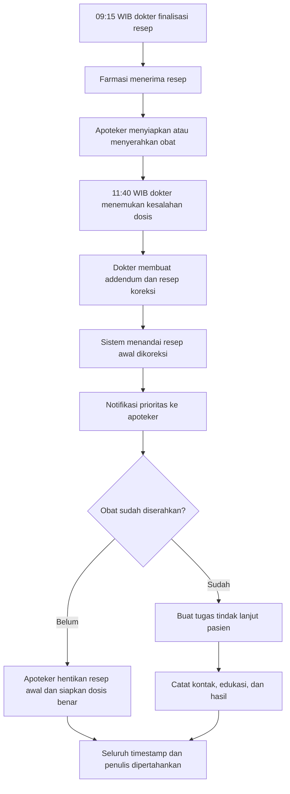
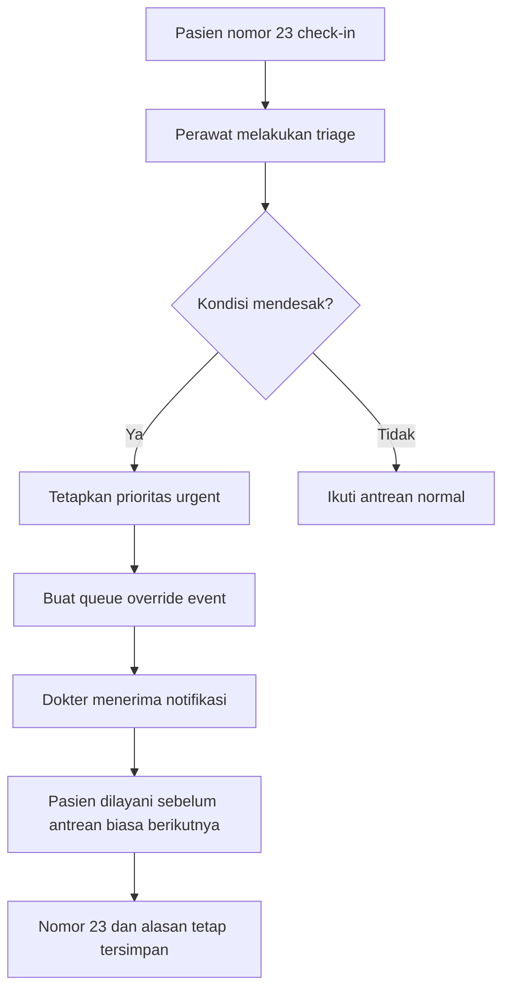
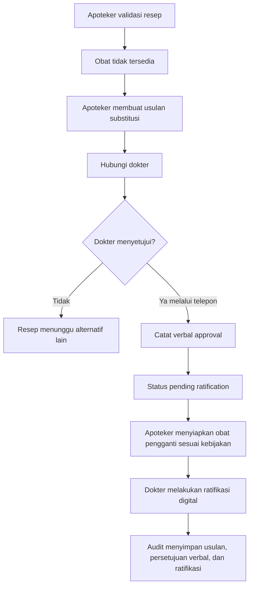
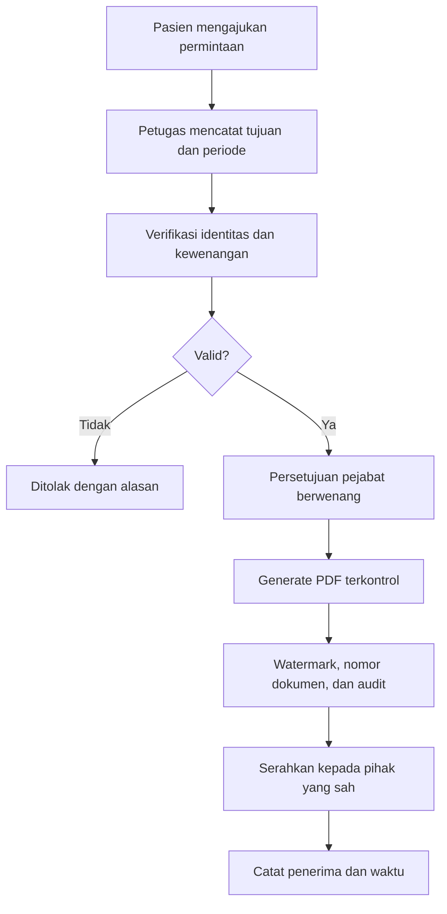
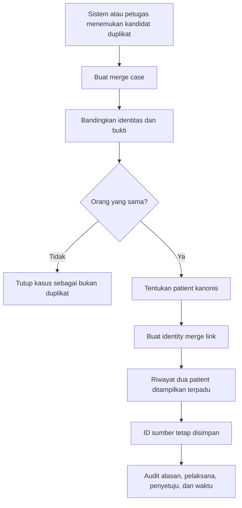
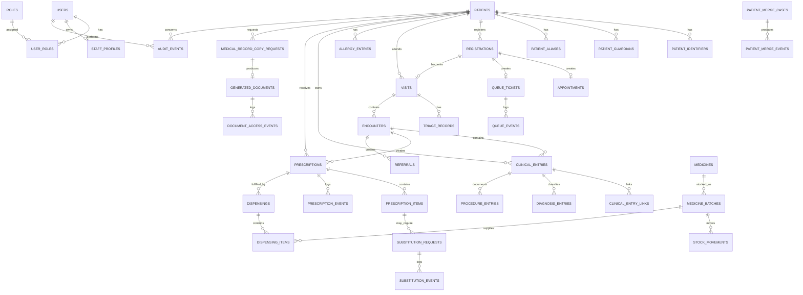
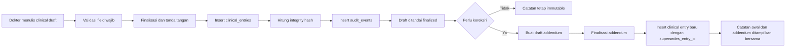

# Product Requirements Document (PRD)
## Sistem Informasi Klinik Terintegrasi

**Stack utama menggunakan Laravel 13** sebagai backend dan web application framework, Blade sebagai server-side template, Tailwind CSS sebagai utility-first CSS framework, Alpine.js untuk interaksi frontend ringan, Vite untuk asset bundling, MariaDB 10.11 dengan storage engine InnoDB sebagai basis data relasional, Redis untuk antrean pekerjaan dan cache, serta object storage privat untuk penyimpanan dokumen. Sistem dibangun sebagai aplikasi web internal dengan kontrol akses berbasis peran, audit trail menyeluruh, dan mekanisme rekam medis immutable.

---

## 1. Informasi Dokumen

| Item | Keterangan |
|---|---|
| Nama produk | Sistem Informasi Klinik Terintegrasi |
| Jenis dokumen | Product Requirements Document |
| Versi | 1.2 |
| Status | Draft untuk pengembangan |
| Target pengguna | Klinik dengan sekitar 80 pasien per hari |
| Platform | Web responsif untuk komputer dan tablet |
| Backend framework | Laravel 13 |
| Rendering frontend | Laravel Blade |
| Styling frontend | Tailwind CSS |
| Interaksi frontend | Alpine.js |
| Asset bundler | Vite |
| Basis data | MariaDB 10.11 dengan InnoDB |
| Zona waktu operasional | WIB (`Asia/Jakarta`, UTC+07:00) |
| Format tanggal dan waktu | `DD-MM-YYYY HH:mm:ss WIB` |
| Bahasa utama | Bahasa Indonesia |
| Ruang lingkup desain visual | Tidak dibahas dalam PRD ini |

> **Asumsi kapasitas:** frasa “sekitar 80 pasien” diasumsikan sebagai sekitar 80 pasien per hari. Kapasitas harus tetap dapat ditingkatkan tanpa perubahan arsitektur utama.

## 1.1 Arsitektur Stack Teknis

### Backend

- Laravel 13 menggunakan pola MVC, Service, Action, Policy, Event, Listener, dan Job.
- Eloquent ORM dan Laravel Query Builder digunakan untuk akses data.
- Koneksi MariaDB menggunakan driver Laravel `mysql`.
- Queue, cache, distributed lock, dan notifikasi internal menggunakan Redis.
- Dokumen PDF dan hasil ekspor disimpan pada object storage privat.

### Frontend

- Laravel Blade digunakan sebagai server-side rendering utama.
- Tailwind CSS digunakan untuk styling dan responsive layout.
- Alpine.js digunakan untuk state dan interaksi ringan seperti modal, dropdown, tab, acknowledgement peringatan alergi, polling status antrean, dan konfirmasi finalisasi.
- Vite digunakan untuk membangun aset CSS dan JavaScript.
- Aplikasi bukan single-page application pada versi awal; keputusan otorisasi dan validasi klinis tetap dilakukan oleh server Laravel.
- Data klinis sensitif tidak boleh disimpan pada `localStorage`, `sessionStorage`, atribut HTML tersembunyi, atau state Alpine lebih lama dari kebutuhan tampilan aktif.

### Database

- MariaDB 10.11 menggunakan storage engine InnoDB untuk transaksi, foreign key, dan row-level locking.
- Character set menggunakan `utf8mb4` dengan collation yang konsisten pada seluruh tabel.
- Primary key aplikasi menggunakan UUID yang dibuat oleh Laravel dan disimpan sebagai `CHAR(36)` untuk kompatibilitas migration dan Eloquent yang sederhana.
- Seluruh waktu bisnis disimpan sebagai `DATETIME(6)` dan wajib diinterpretasikan sebagai WIB (`Asia/Jakarta`, UTC+07:00). Nilai tidak dikonversi mengikuti zona waktu perangkat pengguna.
- Kolom fleksibel menggunakan tipe `JSON`; field yang sering dicari, difilter, diurutkan, atau dipakai untuk laporan tetap dibuat sebagai kolom relasional biasa.
- Akun database runtime, migrator, backup, dan reporting dipisahkan berdasarkan least privilege.

## 1.2 Konvensi Tanggal dan Waktu WIB

1. Zona waktu resmi aplikasi adalah **Waktu Indonesia Barat (WIB)** dengan identifier IANA `Asia/Jakarta` dan offset tetap UTC+07:00.
2. Konfigurasi Laravel wajib menggunakan:

```php
// config/app.php
'timezone' => env('APP_TIMEZONE', 'Asia/Jakarta'),
```

```dotenv
APP_TIMEZONE=Asia/Jakarta
```

3. Koneksi MariaDB harus menggunakan zona waktu sesi `+07:00`. Pada saat koneksi dibuat, aplikasi memastikan perintah berikut berlaku:

```sql
SET time_zone = '+07:00';
```

4. Semua kolom tanggal dan waktu transaksi menggunakan `DATETIME(6)`. MariaDB `DATETIME` tidak menyimpan metadata zona waktu, sehingga konvensi sistem menetapkan bahwa seluruh nilai tersebut selalu merupakan waktu WIB.
5. Sistem tidak mengubah waktu berdasarkan zona waktu browser, sistem operasi pengguna, atau lokasi pengguna. Seluruh pengguna melihat waktu operasional klinik yang sama.
6. Format tampilan standar adalah:

```text
Tanggal          : DD-MM-YYYY
Tanggal dan waktu: DD-MM-YYYY HH:mm:ss WIB
Contoh           : 01-08-2026 09:15:00 WIB
```

7. Nilai tanggal dan waktu pada API menggunakan ISO 8601 dengan offset `+07:00`, misalnya:

```json
{
  "recorded_at": "2026-08-01T09:15:00+07:00"
}
```

8. Input `datetime-local` dari Blade atau Alpine.js dianggap sebagai WIB dan harus divalidasi serta dinormalisasi oleh Laravel sebelum disimpan.
9. `created_at`, `updated_at`, `recorded_at`, `finalized_at`, `occurred_at`, waktu antrean, waktu resep, waktu dispensing, dan audit event dibuat oleh server. Pengguna tidak boleh mengisi atau mengubah waktu pencatatan server.
10. Waktu kejadian klinis yang dilaporkan terlambat boleh disimpan pada kolom seperti `clinical_time`, tetapi:
    - Tetap menggunakan WIB.
    - Tidak boleh menggantikan `recorded_at`.
    - Harus disertai alasan apabila berbeda secara material dari waktu pencatatan.
11. Server aplikasi, worker, scheduler, dan server database harus tersinkronisasi menggunakan NTP.
12. Filter laporan harian dan bulanan menggunakan batas hari WIB:
    - Awal hari: `00:00:00.000000 WIB`.
    - Akhir hari berikutnya sebagai batas eksklusif.
13. Nama file ekspor yang memuat waktu menggunakan format aman:

```text
YYYYMMDD_HHmmss_WIB
```

14. Daylight saving time tidak digunakan karena zona `Asia/Jakarta` tidak menerapkan perubahan jam musiman.

---

## 2. Latar Belakang

Klinik saat ini melayani pasien umum dan peserta jaminan kesehatan. Operasional klinik melibatkan dokter, dokter gigi yang praktik tiga kali seminggu, dua perawat, satu apoteker, dan satu petugas pendaftaran.

Proses pendaftaran, antrean, pemeriksaan, resep, penyiapan obat, dan rekam medis masih menggunakan telepon, nomor antrean meja, tulisan tangan, serta dokumen kertas. Kondisi tersebut menimbulkan beberapa masalah:

1. Perebutan dan ketidakjelasan antrean.
2. Riwayat pasien sulit dibaca dan dicari.
3. Informasi alergi dapat terselip.
4. Kesalahan dosis sulit dikoreksi tanpa menghilangkan jejak awal.
5. Obat kosong membutuhkan komunikasi manual.
6. Satu kedatangan dengan beberapa pemeriksaan berisiko dihitung ganda.
7. Data pasien ganda sulit disatukan.
8. Laporan bulanan memerlukan rekap manual.
9. Informasi diagnosis berisiko terlihat oleh pihak yang tidak berwenang.
10. Rekam medis kertas tidak menjamin ketertelusuran penulis, waktu, dan perubahan.

Sistem baru harus memindahkan proses tersebut menjadi sistem digital penuh tanpa mengurangi prinsip kerahasiaan, integritas, ketersediaan, dan ketertelusuran rekam medis.

---

## 3. Tujuan Produk

### 3.1 Tujuan utama

1. Mendigitalisasi alur klinik dari pendaftaran sampai pelayanan obat.
2. Menyediakan satu identitas pasien yang tetap dapat digunakan walaupun pasien belum memiliki NIK.
3. Menjamin rekam medis yang telah disahkan tidak dapat diubah atau dihapus.
4. Menyediakan koreksi melalui catatan tambahan yang tetap menyimpan catatan awal.
5. Menampilkan alergi secara dini dan mencolok kepada petugas yang berhak.
6. Menangani antrean berdasarkan nomor dan tingkat kegawatan.
7. Mendukung satu kunjungan dengan lebih dari satu pemeriksaan.
8. Mengintegrasikan resep dokter dengan proses farmasi dan stok obat.
9. Membatasi akses data berdasarkan tugas pengguna.
10. Menghasilkan laporan operasional dan laporan bulanan klinik.
11. Menyimpan audit trail atas setiap akses dan tindakan penting.

### 3.2 Indikator keberhasilan

| Indikator | Target |
|---|---|
| Rekam medis final yang dapat diubah atau dihapus | 0 |
| Akses diagnosis oleh petugas pendaftaran | 0 |
| Resep masuk ke farmasi secara elektronik | 100% |
| Perubahan dosis tanpa jejak koreksi | 0 |
| Pasien tanpa NIK tetap dapat dilayani | 100% |
| Alergi diketahui sebelum pemeriksaan dan pemberian obat | 100% saat data alergi tersedia |
| Laporan bulanan dapat dibuat otomatis | Maksimal 5 menit |
| Penggabungan pasien ganda yang menghapus riwayat | 0 |
| Tindakan penting tanpa identitas pelaku dan waktu | 0 |

---

## 4. Prinsip Mutlak Sistem

Ketentuan berikut bersifat wajib dan tidak boleh dinonaktifkan melalui konfigurasi biasa.

### 4.1 Rekam medis immutable

1. Rekam medis yang telah difinalisasi tidak boleh diubah.
2. Rekam medis yang telah difinalisasi tidak boleh dihapus.
3. Koreksi dilakukan dengan membuat **addendum**, **koreksi**, atau **pembatalan klinis** baru yang merujuk catatan awal.
4. Catatan awal selalu tetap terlihat bagi pengguna klinis yang berwenang.
5. Sistem harus menampilkan siapa yang membuat catatan, kapan dibuat, kapan difinalisasi, dan perangkat atau sesi yang digunakan.
6. Tidak boleh ada fungsi “edit bebas” terhadap catatan klinis final.
7. Pengguna database aplikasi tidak memiliki izin `UPDATE` dan `DELETE` pada tabel rekam medis final.
8. Database harus memiliki trigger atau rule yang menolak perubahan dan penghapusan pada tabel immutable.
9. Setiap entri final memiliki hash integritas dan dapat dirangkai dengan hash entri sebelumnya.
10. Backup, ekspor, dan pemulihan tidak boleh menghilangkan audit trail.

### 4.2 Pemisahan draft dan catatan final

1. Dokter dapat menulis pada area draft sebelum menekan tindakan **Finalisasi dan Tanda Tangan**.
2. Draft bukan rekam medis final dan hanya dapat dilihat penulisnya serta pihak klinis yang diberi hak.
3. Setelah difinalisasi, isi dipindahkan atau disalin menjadi entri immutable.
4. Perubahan setelah finalisasi harus menjadi addendum baru.
5. Resep yang sudah dikirim ke farmasi dianggap final dan tidak dapat diedit.

### 4.3 Kerahasiaan berdasarkan kebutuhan kerja

1. Petugas pendaftaran hanya melihat data identitas, penjamin, jadwal, antrean, tanda alergi, dan status layanan yang diperlukan.
2. Petugas pendaftaran tidak melihat isi diagnosis, anamnesis, catatan dokter, atau detail terapi.
3. Perawat hanya melihat informasi klinis sesuai penugasan.
4. Apoteker hanya melihat data yang diperlukan untuk validasi resep, alergi, obat, dosis, dan informasi relevan terhadap keamanan obat.
5. Pemilik klinik melihat data agregat dan laporan manajemen. Akses ke data klinis individual harus diberikan secara khusus dan tercatat.
6. Setiap pembukaan rekam medis pasien dicatat dalam audit log.
7. Data sensitif tidak boleh muncul pada notifikasi umum, URL, log aplikasi biasa, atau pesan kesalahan.

---

## 5. Ruang Lingkup

### 5.1 Termasuk dalam sistem

- Manajemen pengguna, peran, dan hak akses.
- Data pasien dan berbagai identitas pasien.
- Hubungan pasien bayi dengan orang tua atau wali.
- Pendaftaran melalui telepon dan meja pendaftaran.
- Reservasi jadwal dan nomor antrean.
- Check-in kedatangan.
- Triage dan prioritas kegawatan.
- Kunjungan pasien.
- Pemeriksaan dokter umum dan dokter gigi.
- Riwayat penyakit, alergi, obat, tindakan, dan rujukan.
- Rekam medis immutable dan addendum.
- Resep elektronik.
- Resep obat jadi dan racikan.
- Permintaan substitusi obat.
- Persetujuan dokter melalui sistem atau persetujuan verbal melalui telepon yang dicatat.
- Penyiapan dan penyerahan obat.
- Stok obat, batch, kedaluwarsa, dan pergerakan stok.
- Permintaan salinan rekam medis.
- Deteksi dan penggabungan identitas pasien ganda.
- Laporan dokter, kunjungan, pasien, dan sepuluh penyakit terbanyak.
- Audit log dan pelaporan keamanan.
- Backup dan pemulihan data.

### 5.2 Tidak termasuk dalam versi awal

- Desain visual dan design system.
- Telemedicine atau konsultasi video.
- Integrasi langsung dengan sistem eksternal jaminan kesehatan.
- Pembayaran daring.
- Sistem akuntansi lengkap.
- Sistem laboratorium atau radiologi penuh.
- Aplikasi seluler native.
- Penggunaan kecerdasan buatan untuk diagnosis.
- Penghapusan permanen rekam medis.

---

## 6. Aktor dan Peran

| Peran | Jumlah awal | Tanggung jawab utama |
|---|---:|---|
| Pemilik klinik | 1 | Melihat laporan agregat, performa layanan, dan administrasi pengguna tertentu |
| Dokter umum | Sesuai operasional | Pemeriksaan, diagnosis, terapi, resep, rujukan, dan koreksi klinis |
| Dokter gigi | 1 | Pemeriksaan gigi, tindakan gigi, resep, dan rujukan |
| Perawat | 2 | Triage, tanda vital, tindakan keperawatan, dan membantu alur pelayanan |
| Apoteker | 1 | Validasi resep, substitusi, peracikan, penyiapan, penyerahan, dan stok |
| Petugas pendaftaran | 1 | Pendaftaran pasien, identitas, penjamin, jadwal, antrean, dan check-in |
| Administrator sistem | Terbatas | Konfigurasi teknis, akun, backup; tidak otomatis berhak membaca isi klinis |
| Pasien | Eksternal | Menerima layanan dan meminta salinan rekam medis |

### 6.1 Prinsip akses

Hak akses menggunakan gabungan:

- **Role-Based Access Control** untuk hak berdasarkan jabatan.
- **Attribute-Based Access Control** untuk mempertimbangkan unit, penugasan, pasien, waktu, dan konteks.
- **Field-level authorization** untuk menyembunyikan kolom klinis dari petugas nonklinis.
- **Break-glass access** hanya untuk kondisi darurat, dengan alasan wajib, persetujuan, dan audit prioritas tinggi.

---

## 7. Konsep Data Utama

### 7.1 Patient

Individu yang menerima pelayanan. Patient tidak bergantung pada keberadaan NIK.

### 7.2 Medical Record Number

Nomor rekam medis internal klinik yang dibuat sekali dan tidak berubah.

### 7.3 Patient Identifier

Identitas tambahan seperti NIK, nomor akta kelahiran, nomor peserta jaminan kesehatan, paspor, atau identitas sementara.

### 7.4 Visit

Satu kedatangan pasien ke klinik pada suatu hari atau rangkaian layanan yang sama.

### 7.5 Encounter

Satu pemeriksaan oleh satu layanan atau tenaga klinis. Satu visit dapat memiliki beberapa encounter.

Contoh:

- Pasien datang satu kali.
- Diperiksa dokter umum.
- Dirujuk ke dokter gigi pada hari yang sama.
- Sistem mencatat **1 visit** dan **2 encounter**.

### 7.6 Clinical Entry

Catatan klinis final yang immutable, seperti anamnesis, pemeriksaan, diagnosis, tindakan, instruksi, atau catatan lain.

### 7.7 Addendum

Catatan baru untuk memperbaiki, menjelaskan, atau melengkapi clinical entry sebelumnya tanpa mengubah catatan awal.

### 7.8 Prescription

Resep final dari dokter kepada farmasi. Perubahan resep dibuat sebagai resep koreksi atau pembatalan baru, bukan mengedit resep awal.

---

## 8. Kebutuhan Fungsional

## FR-01 Autentikasi dan akun pengguna

1. Pengguna masuk menggunakan akun individual.
2. Akun bersama dilarang.
3. Sistem mendukung kata sandi kuat dan autentikasi dua faktor untuk peran klinis dan administrator.
4. Sesi berakhir otomatis setelah periode tidak aktif.
5. Percobaan login gagal dicatat.
6. Akun dapat dinonaktifkan tanpa menghapus riwayat tindakannya.
7. Perubahan peran harus tercatat dalam audit log.
8. Administrator teknis tidak otomatis memperoleh hak membaca rekam medis.

### Kriteria penerimaan

- Setiap tindakan memiliki `user_id`.
- Pengguna nonaktif tidak dapat login.
- Riwayat tindakan pengguna tetap tersedia setelah akun dinonaktifkan.
- Petugas pendaftaran gagal saat mencoba endpoint diagnosis.

---

## FR-02 Manajemen pasien dan identitas

1. Sistem membuat nomor rekam medis internal otomatis.
2. NIK tidak wajib saat pendaftaran pasien.
3. Pasien bayi dapat didaftarkan menggunakan:
   - Nama sementara atau nama resmi jika sudah tersedia.
   - Tanggal lahir.
   - Jenis kelamin.
   - Data ibu, ayah, atau wali.
   - Nomor rekam medis internal.
4. NIK dapat ditambahkan kemudian sebagai identifier baru.
5. Penambahan NIK tidak membuat pasien baru.
6. Setiap identifier memiliki jenis, nilai, status verifikasi, sumber, waktu berlaku, dan pencatat.
7. Sistem memeriksa potensi duplikasi berdasarkan nama, tanggal lahir, wali, nomor telepon, alamat, dan identifier.
8. Perubahan data demografi harus memiliki histori perubahan.
9. Perubahan data demografi tidak boleh mengubah clinical entry yang sudah final.

### Kriteria penerimaan

- Bayi tanpa NIK dapat didaftarkan dan memperoleh nomor rekam medis.
- Tiga bulan kemudian NIK dapat ditambahkan ke pasien yang sama.
- Seluruh riwayat kunjungan sebelumnya tetap terhubung.
- NIK yang sama tidak dapat aktif pada dua pasien berbeda tanpa proses investigasi duplikasi.

---

## FR-03 Penjamin pasien

1. Pasien dapat memiliki jenis pembayaran:
   - Umum.
   - Jaminan kesehatan.
   - Asuransi lain.
2. Satu pasien dapat memiliki beberapa data penjamin.
3. Data penjamin dapat memiliki masa berlaku.
4. Petugas pendaftaran dapat memverifikasi status administrasi.
5. Informasi diagnosis tidak ditampilkan untuk proses administrasi biasa.
6. Klaim dan dokumen pendukung harus memiliki audit akses.

---

## FR-04 Pendaftaran dan reservasi antrean

1. Petugas dapat mendaftarkan pasien melalui telepon.
2. Petugas dapat mendaftarkan pasien yang datang langsung.
3. Sistem menghasilkan nomor reservasi dan nomor antrean.
4. Nomor antrean tidak dapat diklaim oleh dua pasien.
5. Sistem menyimpan kanal pendaftaran: telepon, meja, atau kanal lain.
6. Reservasi memiliki batas waktu check-in.
7. Nomor yang tidak check-in dapat berstatus tidak hadir.
8. Pasien yang terlambat mengikuti aturan antrean klinik yang dapat dikonfigurasi.
9. Pendaftaran menampilkan jadwal dokter gigi tiga kali seminggu.
10. Sistem mencegah pendaftaran ke dokter yang tidak sedang praktik.
11. Petugas dapat melihat tanda alergi secara mencolok tanpa melihat diagnosis.
12. Data klinis selain indikator keselamatan tidak ditampilkan.

### Kriteria penerimaan

- Dua petugas atau sesi tidak dapat memperoleh nomor antrean yang sama.
- Nomor antrean diberikan secara atomik oleh database.
- Jadwal dokter gigi hanya tersedia pada hari praktik.
- Indikator alergi tampil saat pasien dipilih.

---

## FR-05 Check-in dan antrean pelayanan

1. Reservasi berubah menjadi check-in saat pasien datang.
2. Antrean biasa dipanggil berdasarkan urutan.
3. Antrean dapat diprioritaskan melalui triage.
4. Perubahan prioritas wajib memiliki alasan dan petugas penilai.
5. Nomor antrean asli tidak dihapus.
6. Sistem menyimpan urutan awal dan urutan pelayanan aktual.
7. Sistem menampilkan status: menunggu, dipanggil, triage, diperiksa, farmasi, selesai, batal, atau tidak hadir.
8. Setiap perubahan status memiliki timestamp.

---

## FR-06 Triage dan pasien prioritas

1. Perawat atau tenaga klinis berwenang dapat melakukan triage.
2. Triage menyimpan keluhan utama, kondisi umum, tanda vital, tingkat prioritas, dan alasan.
3. Pasien dengan luka terbuka atau keadaan mendesak dapat diprioritaskan walaupun nomor antreannya lebih besar.
4. Sistem tidak menghapus atau mengganti nomor antrean.
5. Sistem membuat **queue override event**.
6. Petugas harus memilih atau menulis alasan klinis.
7. Dokter menerima notifikasi prioritas.
8. Pasien lain tetap memiliki urutan yang dapat ditelusuri.

### Kriteria penerimaan kasus

Pasien nomor 23 dapat dilayani sebelum nomor 10 apabila triage menetapkan prioritas. Sistem tetap menyimpan:

- Nomor awal: 23.
- Posisi pelayanan aktual.
- Alasan: luka terbuka atau alasan klinis lain.
- Nama perawat atau tenaga klinis.
- Waktu triage.
- Waktu perubahan prioritas.

---

## FR-07 Visit dan multi-encounter

1. Satu kedatangan dibuat sebagai satu visit.
2. Setiap pemeriksaan dibuat sebagai encounter terpisah.
3. Visit dapat memiliki encounter dokter umum dan dokter gigi pada hari yang sama.
4. Setiap encounter memiliki tenaga penanggung jawab, layanan, waktu mulai, waktu selesai, dan status.
5. Rujukan internal membuat encounter tujuan tanpa membuat visit baru.
6. Laporan kunjungan menggunakan jumlah visit.
7. Laporan beban dokter menggunakan encounter dan pasien unik.
8. Sistem mencegah satu encounter aktif ditangani dua dokter sebagai penanggung jawab utama, kecuali kolaborasi dicatat.

---

## FR-08 Riwayat pasien dan alergi

1. Dokter melihat ringkasan riwayat:
   - Keluhan dan penyakit sebelumnya.
   - Diagnosis sebelumnya.
   - Obat yang pernah diresepkan.
   - Riwayat alergi.
   - Reaksi alergi.
   - Tindakan dan rujukan.
2. Alergi tampil sebelum dokter membuat resep.
3. Apoteker melihat alergi saat resep diterima.
4. Petugas pendaftaran hanya melihat penanda keselamatan seperti “Memiliki alergi obat”, bukan seluruh diagnosis.
5. Menonaktifkan data alergi harus menggunakan status “tidak lagi aktif” atau “dibantah”, bukan menghapus.
6. Setiap perubahan alergi memiliki pencatat, sumber informasi, waktu, dan alasan.

---

## FR-09 Rekam medis elektronik immutable

1. Catatan klinis dibuat dalam konteks encounter.
2. Jenis catatan minimal:
   - Anamnesis.
   - Pemeriksaan fisik.
   - Tanda vital.
   - Diagnosis.
   - Tindakan.
   - Edukasi.
   - Rencana.
   - Rujukan.
   - Catatan perkembangan.
3. Catatan final memiliki:
   - Penulis.
   - Peran penulis.
   - Waktu pencatatan.
   - Waktu pelayanan.
   - Waktu finalisasi.
   - Encounter.
   - Nomor versi logis.
   - Hash integritas.
4. Setelah finalisasi, endpoint edit dan hapus tidak tersedia.
5. Koreksi dibuat sebagai addendum.
6. Addendum wajib memiliki alasan dan menunjuk catatan yang dikoreksi.
7. Sistem menampilkan urutan kronologis catatan asli dan addendum.
8. Catatan yang salah dapat diberi status “dikoreksi” atau “tidak berlaku untuk penggunaan selanjutnya”, tetapi tidak hilang.
9. Akses baca dicatat.
10. Ekspor rekam medis menampilkan catatan awal dan koreksi yang relevan.

### Kriteria penerimaan

- Perintah `UPDATE` atau `DELETE` pada tabel clinical entry ditolak database.
- Dokter tidak menemukan tombol edit setelah finalisasi.
- Addendum menampilkan referensi ke entri awal.
- Catatan awal tetap dapat dibaca oleh pihak berwenang.
- Audit menunjukkan penulis dan waktu seluruh entri.

---

## FR-10 Koreksi kesalahan dosis

1. Resep yang telah dikirim ke farmasi tidak dapat diedit.
2. Dokter membuat koreksi resep yang merujuk resep awal.
3. Sistem menandai resep awal sebagai:
   - Aktif.
   - Dikoreksi.
   - Dibatalkan.
   - Telah diserahkan sebagian.
   - Telah diserahkan seluruhnya.
4. Koreksi menyimpan:
   - Dosis awal.
   - Dosis yang benar.
   - Alasan koreksi.
   - Waktu diketahui.
   - Penulis koreksi.
   - Dampak terhadap obat yang sudah diserahkan.
5. Farmasi menerima notifikasi prioritas.
6. Apoteker wajib mencatat apakah obat sudah:
   - Belum disiapkan.
   - Sedang disiapkan.
   - Sudah diserahkan.
7. Jika obat sudah diserahkan, sistem membuat tugas tindak lanjut pasien.
8. Catatan pukul 09:15 dan koreksi pukul 11:40 harus tetap terlihat.
9. Tidak ada backdating untuk menyamarkan waktu koreksi.

### Contoh hasil catatan

- 09:15 WIB — Resep awal difinalisasi dokter dan diterima farmasi.
- 09:25 WIB — Obat diserahkan, jika memang sudah diserahkan.
- 11:40 WIB — Dokter membuat addendum koreksi dosis.
- 11:41 WIB — Apoteker menerima peringatan.
- 11:45 WIB — Tindak lanjut pasien dicatat.

---

## FR-11 Resep elektronik

1. Dokter membuat resep pada encounter.
2. Sistem memeriksa alergi dan interaksi dasar yang dikonfigurasi.
3. Resep terdiri dari satu atau lebih item.
4. Item resep menyimpan:
   - Obat.
   - Bentuk dan kekuatan.
   - Dosis.
   - Frekuensi.
   - Rute.
   - Durasi.
   - Jumlah.
   - Instruksi.
   - Jenis obat jadi atau racikan.
5. Racikan memiliki formula dan komponen.
6. Setelah dokter mengirim resep, farmasi menerima secara real-time.
7. Resep final tidak dapat diedit.
8. Koreksi menghasilkan resep atau addendum baru.
9. Dokter dapat membatalkan resep dengan alasan selama tetap menyimpan resep awal.
10. Sistem menyimpan status tiap item dan status keseluruhan resep.

---

## FR-12 Farmasi dan penyiapan obat

1. Apoteker melihat antrean resep masuk.
2. Resep menampilkan prioritas, alergi, dan catatan keselamatan.
3. Apoteker dapat menandai:
   - Diterima.
   - Dalam validasi.
   - Menunggu konfirmasi.
   - Disiapkan.
   - Diracik.
   - Siap diserahkan.
   - Diserahkan.
   - Dibatalkan.
4. Obat jadi dapat langsung dipilih dari stok.
5. Obat racikan memiliki proses peracikan dan pencatatan pelaksana.
6. Penyerahan obat mencatat pasien atau penerima, waktu, apoteker, jumlah, dan batch.
7. Stok berkurang melalui stock movement, bukan mengubah angka tanpa jejak.
8. Obat kedaluwarsa atau diblokir tidak dapat dipilih untuk penyerahan.

---

## FR-13 Obat kosong dan substitusi

1. Apoteker dapat menandai item resep tidak tersedia.
2. Apoteker membuat permintaan substitusi.
3. Permintaan menyimpan obat awal, obat usulan, alasan, ketersediaan, dan catatan apoteker.
4. Dokter dapat menyetujui atau menolak melalui sistem.
5. Persetujuan melalui telepon dapat dicatat sebagai **persetujuan verbal**.
6. Persetujuan verbal harus menyimpan:
   - Nama dokter pemberi persetujuan.
   - Nama apoteker pencatat.
   - Waktu panggilan.
   - Nomor atau kanal komunikasi jika relevan.
   - Isi substitusi yang disetujui.
   - Alasan.
   - Saksi kedua jika kebijakan klinik mewajibkan.
7. Status persetujuan verbal adalah `VERBAL_APPROVED_PENDING_RATIFICATION`.
8. Dokter harus mengonfirmasi ulang secara digital pada login berikutnya.
9. Konfirmasi digital tidak mengubah catatan verbal; sistem menambah event ratifikasi.
10. Obat pengganti harus terkait dengan resep awal dan tidak menimpa item awal.
11. Penyerahan berdasarkan persetujuan verbal mengikuti kebijakan klinik dan harus memiliki audit berprioritas tinggi.

---

## FR-14 Rujukan internal dan eksternal

1. Dokter dapat merujuk ke dokter gigi pada visit yang sama.
2. Rujukan internal membuat encounter baru.
3. Sistem menjaga visit tetap satu.
4. Rujukan menyimpan alasan, tujuan, prioritas, dan pembuat.
5. Dokter gigi melihat informasi yang relevan terhadap rujukan.
6. Rujukan eksternal dapat menghasilkan surat rujukan.
7. Surat rujukan merupakan dokumen final dan memiliki versi atau addendum jika dikoreksi.

---

## FR-15 Permintaan salinan rekam medis

1. Pasien atau pihak yang sah dapat mengajukan permintaan.
2. Petugas mencatat tujuan, ruang lingkup, periode, dan format.
3. Identitas pemohon harus diverifikasi.
4. Jika pemohon bukan pasien, dasar kewenangan atau persetujuan pasien harus dicatat.
5. Permintaan memiliki status:
   - Diajukan.
   - Verifikasi.
   - Disetujui.
   - Ditolak.
   - Disiapkan.
   - Diserahkan.
6. Sistem menghasilkan salinan terkontrol dalam PDF.
7. Dokumen diberi nomor, watermark, tanggal, tujuan, dan identitas petugas penerbit.
8. Akses dan pengunduhan dicatat.
9. Salinan hanya memuat ruang lingkup yang disetujui.
10. Penyerahan dicatat beserta penerima dan waktu.
11. Isi rekam medis asli tidak berubah akibat proses ini.

---

## FR-16 Deteksi dan penggabungan pasien ganda

1. Sistem memberikan peringatan calon duplikat saat pendaftaran.
2. Kriteria dapat mencakup nama mirip, tanggal lahir, nomor telepon, alamat, penjamin, atau keluarga.
3. Penggabungan hanya dapat dilakukan oleh petugas berwenang setelah verifikasi.
4. Tidak ada pasien atau riwayat yang dihapus.
5. Satu pasien ditetapkan sebagai identitas kanonis.
6. Pasien lain menjadi identitas sumber yang terhubung ke pasien kanonis.
7. Semua visit, encounter, resep, dan dokumen tetap mempertahankan ID asal untuk audit.
8. Tampilan klinis menggabungkan riwayat berdasarkan identitas kanonis.
9. Sistem menyimpan alasan, bukti, pelaksana, penyetuju, dan waktu penggabungan.
10. Penggabungan dapat dibatalkan melalui event pemisahan jika terbukti salah; bukan dengan menghapus riwayat merge.
11. Nama “Siti Aminah” dan “Siti Aminah S.” dapat ditetapkan sebagai orang yang sama tanpa kehilangan dua riwayat tiga tahun sebelumnya.

---

## FR-17 Jadwal dokter

1. Sistem menyimpan jadwal praktik per dokter.
2. Dokter gigi dapat dijadwalkan tiga kali seminggu.
3. Jadwal dapat memiliki pengecualian, cuti, dan perubahan.
4. Perubahan jadwal dicatat.
5. Pendaftaran hanya dapat memilih slot aktif.
6. Pemilik dan petugas pendaftaran dapat melihat jadwal, tetapi tidak otomatis melihat data klinis pasien.

---

## FR-18 Laporan manajemen dan dinas kesehatan

### 18.1 Laporan performa dokter

Sistem menyediakan:

- Jumlah encounter per dokter.
- Jumlah pasien unik per dokter.
- Jumlah visit yang melibatkan dokter.
- Jumlah layanan per jenis layanan.
- Periode harian, mingguan, bulanan, dan rentang tanggal.
- Pemisahan dokter umum dan dokter gigi.

> Untuk menghindari interpretasi salah, laporan harus menampilkan **jumlah pemeriksaan** dan **jumlah pasien unik**, bukan hanya satu angka “pasien ditangani”.

### 18.2 Laporan bulanan wajib

Minimal memuat:

1. Jumlah visit.
2. Jumlah encounter.
3. Jumlah pasien unik.
4. Jumlah pasien baru.
5. Jumlah pasien lama.
6. Jumlah pasien umum.
7. Jumlah peserta jaminan kesehatan.
8. Sepuluh diagnosis atau penyakit terbanyak.
9. Distribusi layanan dokter umum dan dokter gigi.
10. Data agregat lain yang dikonfigurasi klinik.

### 18.3 Ketentuan privasi laporan

1. Laporan manajemen default tidak menampilkan nama pasien.
2. Drill-down ke pasien hanya untuk peran berwenang.
3. Petugas pendaftaran tidak dapat mengakses laporan diagnosis.
4. Ekspor laporan dicatat.
5. File laporan memiliki masa berlaku atau kontrol akses jika disimpan.

---

## FR-19 Audit trail

Audit wajib mencatat:

- Login dan logout.
- Login gagal.
- Pembuatan dan perubahan akun.
- Perubahan peran.
- Pencarian pasien.
- Pembukaan rekam medis.
- Pembuatan draft.
- Finalisasi clinical entry.
- Pembuatan addendum.
- Pembuatan, koreksi, dan pembatalan resep.
- Permintaan dan persetujuan substitusi.
- Penyiapan dan penyerahan obat.
- Perubahan stok.
- Triage dan perubahan prioritas.
- Permintaan dan penyerahan salinan rekam medis.
- Penggabungan pasien ganda.
- Ekspor laporan.
- Break-glass access.
- Upaya akses yang ditolak.

Setiap event minimal memiliki:

- ID event.
- User.
- Peran aktif.
- Jenis aksi.
- Objek dan ID objek.
- Waktu server dalam WIB.
- Alamat IP.
- User agent atau device.
- Alasan jika diperlukan.
- Hasil berhasil atau ditolak.
- Hash event.
- Hash event sebelumnya.

Audit log bersifat append-only dan tidak dapat diedit atau dihapus oleh pengguna aplikasi.

---

## 9. Matriks Hak Akses Ringkas

Legenda:

- **C**: create.
- **R**: read.
- **A**: membuat addendum atau aksi lanjutan.
- **X**: tidak boleh.

| Data/Fungsi | Pendaftaran | Perawat | Dokter | Dokter Gigi | Apoteker | Pemilik | Admin Sistem |
|---|---:|---:|---:|---:|---:|---:|---:|
| Identitas pasien | C/R | R | R | R | R terbatas | R terbatas | R teknis terbatas |
| Penjamin | C/R | R terbatas | R terbatas | R terbatas | X | R agregat | X |
| Penanda alergi | R indikator | C/R | C/R/A | C/R/A | R | R agregat | X |
| Detail alergi klinis | X | R | C/R/A | C/R/A | R | X default | X |
| Triage | X | C/R/A | R/A | R/A | X | Agregat | X |
| Anamnesis | X | R sesuai tugas | C/R/A | C/R/A | X | X default | X |
| Diagnosis | X | R sesuai tugas | C/R/A | C/R/A | R terbatas bila relevan | Agregat | X |
| Resep | Status saja | R terbatas | C/R/A | C/R/A | R/proses | Agregat | X |
| Stok obat | X | X | R ketersediaan | R ketersediaan | C/R | R laporan | R teknis |
| Salinan rekam medis | Proses administratif | R bila ditugaskan | Persetujuan klinis | Persetujuan klinis | X | R status | X |
| Laporan diagnosis | X | X | R sesuai izin | R sesuai izin | X | R agregat | X |
| Audit keamanan | X | X | Riwayat sendiri | Riwayat sendiri | Riwayat sendiri | R terpilih | R teknis |
| Ubah/hapus rekam medis final | X | X | X | X | X | X | X |

---

## 10. Alur Berdasarkan Kejadian

## 10.1 Bayi belum memiliki NIK



Aturan:

- NIK bukan primary key pasien.
- Primary key menggunakan UUID internal.
- Nomor rekam medis tetap.
- Penambahan NIK adalah event identitas, bukan penggantian patient.

---

## 10.2 Kesalahan dosis diketahui setelah resep diserahkan



Aturan:

- Resep pukul 09:15 WIB tidak diedit.
- Koreksi pukul 11:40 WIB tidak boleh dibuat seolah-olah terjadi pukul 09:15 WIB.
- Sistem mempertahankan bukti resep awal, koreksi, status penyerahan, dan tindak lanjut.

---

## 10.3 Pasien nomor 23 dengan luka terbuka



Aturan:

- Nomor antrean bukan satu-satunya penentu urutan.
- Hanya tenaga berwenang yang dapat mengubah prioritas.
- Alasan klinis wajib.

---

## 10.4 Obat kosong dan persetujuan melalui telepon



Aturan:

- Item awal tetap tersimpan.
- Obat pengganti menjadi item substitusi terkait.
- Persetujuan verbal tidak boleh dicatat tanpa waktu, dokter, apoteker, dan isi persetujuan.

---

## 10.5 Pasien meminta salinan rekam medis



---

## 10.6 “Siti Aminah” dan “Siti Aminah S.” adalah pasien yang sama



Aturan:

- Tidak ada record pasien atau riwayat yang dihapus.
- Merge bersifat relasi identitas.
- Query klinis mengikuti patient kanonis dan seluruh source patient.
- Bila merge keliru, dibuat event unmerge dengan jejak lengkap.

---

## 11. State Machine Utama

### 11.1 Appointment atau registration

```text
BOOKED -> CHECKED_IN -> TRIAGED -> IN_SERVICE -> PHARMACY -> COMPLETED
   |          |             |           |
CANCELLED   NO_SHOW      CANCELLED    CANCELLED
```

### 11.2 Encounter

```text
PLANNED -> ACTIVE -> FINALIZED
              |
           CANCELLED
```

Encounter `FINALIZED` tidak dapat kembali menjadi `ACTIVE`. Koreksi dilakukan melalui addendum.

### 11.3 Prescription

```text
DRAFT -> FINALIZED -> RECEIVED_BY_PHARMACY -> PREPARING -> READY -> DISPENSED
               |               |                 |
           CANCELLED       ON_HOLD         CORRECTED
```

Status historis disimpan sebagai event, bukan hanya menimpa satu kolom status.

### 11.4 Substitution request

```text
PROPOSED -> WAITING_DOCTOR
              |-> APPROVED
              |-> REJECTED
              |-> VERBAL_APPROVED_PENDING_RATIFICATION -> RATIFIED
```

### 11.5 Medical record copy request

```text
SUBMITTED -> IDENTITY_VERIFICATION -> APPROVED -> PREPARED -> RELEASED
                    |                    |
                 REJECTED             REJECTED
```

---

## 12. Skema Database

## 12.1 Prinsip skema MariaDB 10.11

1. Seluruh tabel transaksi menggunakan storage engine `InnoDB`.
2. Primary key utama menggunakan UUID dari aplikasi yang disimpan sebagai `CHAR(36)`; kolom foreign key memakai tipe, panjang, dan collation yang sama.
3. Nomor bisnis seperti MRN, booking code, dan nomor antrean memiliki unique constraint pada database.
4. Seluruh waktu disimpan sebagai `DATETIME(6)` dalam WIB (`Asia/Jakarta`, UTC+07:00). Waktu kejadian klinis dan waktu pencatatan server disimpan pada kolom terpisah.
5. Tabel immutable tidak memberikan privilege `UPDATE` dan `DELETE` kepada akun aplikasi runtime.
6. Trigger `BEFORE UPDATE` dan `BEFORE DELETE` menggunakan `SIGNAL SQLSTATE '45000'` sebagai lapisan pertahanan database.
7. Status penting disimpan melalui event table append-only; kolom status saat ini hanya menjadi proyeksi untuk pembacaan cepat.
8. Data identitas, administratif, klinis, farmasi, dokumen, dan audit dipisahkan secara logis.
9. Foreign key wajib digunakan pada relasi yang membutuhkan integritas referensial.
10. Data historis tidak dihapus saat akun, pasien, tenaga kesehatan, atau obat dinonaktifkan.
11. Kolom sensitif dapat dienkripsi oleh Laravel menggunakan application-level encryption; hash pencarian terpisah digunakan bila nilai harus dicocokkan tanpa membuka plaintext.
12. Tipe `JSON` digunakan hanya untuk payload fleksibel. Nilai yang diperlukan untuk pencarian dan laporan disimpan dalam kolom normal atau generated column yang diberi index.
13. Reporting menggunakan SQL view atau tabel ringkasan yang diperbarui oleh Laravel Scheduler; MariaDB 10.11 tidak diasumsikan memiliki materialized view native.
14. Character set default adalah `utf8mb4` dan seluruh tabel menggunakan collation yang konsisten.
15. Migration wajib menentukan index untuk foreign key, status aktif, tanggal layanan, provider, patient canonical, dan kode diagnosis.
16. Akun `clinic_app` hanya untuk runtime; akun migrasi digunakan terpisah dan tidak dipakai oleh web server.
17. Seluruh default timestamp database seperti `CURRENT_TIMESTAMP(6)` dan `NOW(6)` harus dijalankan pada sesi MariaDB dengan `time_zone = '+07:00'`.
18. Query rentang waktu tidak boleh melakukan konversi otomatis ke zona waktu browser. Seluruh batas tanggal dihitung berdasarkan WIB.
19. Nama kolom tidak perlu diberi akhiran `_wib`; makna WIB berlaku sebagai konvensi global untuk seluruh kolom `DATETIME(6)`.

---

## 12.2 Daftar tabel inti

### A. Pengguna dan otorisasi

#### `users`

| Kolom | Tipe | Keterangan |
|---|---|---|
| id | CHAR(36) PK | ID pengguna |
| username | varchar unique | Nama login |
| password_hash | varchar | Hash kata sandi |
| status | enum | active, locked, disabled |
| last_login_at | DATETIME(6) nullable | Login terakhir |
| created_at | DATETIME(6) | Waktu dibuat |
| disabled_at | DATETIME(6) nullable | Waktu dinonaktifkan |

#### `roles`

- `id`
- `code`
- `name`
- `description`

#### `permissions`

- `id`
- `code`
- `resource`
- `action`

#### `user_roles`

- `id`
- `user_id`
- `role_id`
- `valid_from`
- `valid_until`
- `assigned_by`
- `assigned_at`

#### `role_permissions`

- `role_id`
- `permission_id`

#### `staff_profiles`

- `id`
- `user_id`
- `staff_number`
- `full_name`
- `profession`
- `license_number`
- `service_unit`
- `active_from`
- `active_until`

---

### B. Pasien dan identitas

#### `patients`

| Kolom | Tipe | Keterangan |
|---|---|---|
| id | CHAR(36) PK | ID internal pasien |
| medical_record_number | varchar unique | Nomor rekam medis tetap |
| canonical_patient_id | CHAR(36) nullable FK | Diisi jika identitas menjadi sumber merge |
| full_name | varchar | Nama utama saat ini |
| birth_date | date | Tanggal lahir |
| sex | enum | Jenis kelamin |
| deceased_at | DATETIME(6) nullable | Bila relevan |
| status | enum | active, inactive, merged |
| created_by | CHAR(36) FK | Pencatat awal |
| created_at | DATETIME(6) | Waktu dibuat |

#### `patient_identifiers`

| Kolom | Keterangan |
|---|---|
| id | CHAR(36) |
| patient_id | Patient pemilik identifier |
| identifier_type | NIK, birth_certificate, insurer_number, passport, temporary |
| identifier_value | Nilai identifier terenkripsi atau terlindungi |
| normalized_hash | Hash untuk pencarian dan unique checking |
| verified_status | unverified, verified, rejected |
| valid_from | Mulai berlaku |
| valid_until | Akhir berlaku |
| recorded_by | Pencatat |
| recorded_at | Waktu pencatatan |

Constraint penting:

- Identifier aktif yang sama tidak boleh dimiliki dua patient tanpa override kasus merge.
- NIK bukan primary key.

#### `patient_demographic_events`

Append-only untuk perubahan nama, alamat, telepon, atau data administratif.

- `id`
- `patient_id`
- `event_type`
- `old_value_json`
- `new_value_json`
- `reason`
- `recorded_by`
- `recorded_at`

#### `patient_guardians`

- `id`
- `patient_id`
- `guardian_patient_id` nullable
- `guardian_name`
- `relationship`
- `phone`
- `valid_from`
- `valid_until`

#### `patient_aliases`

- `id`
- `patient_id`
- `alias_name`
- `alias_type`
- `recorded_at`

#### `patient_merge_cases`

- `id`
- `status`
- `candidate_patient_a_id`
- `candidate_patient_b_id`
- `reason`
- `evidence_json`
- `created_by`
- `reviewed_by`
- `created_at`
- `decided_at`

#### `patient_merge_events`

Append-only:

- `id`
- `merge_case_id`
- `canonical_patient_id`
- `source_patient_id`
- `event_type`: merged atau unmerged
- `reason`
- `performed_by`
- `approved_by`
- `created_at`

---

### C. Jadwal, pendaftaran, dan antrean

#### `provider_schedules`

- `id`
- `provider_user_id`
- `service_type`
- `day_of_week`
- `start_time`
- `end_time`
- `effective_from`
- `effective_until`
- `status`

#### `schedule_exceptions`

- `id`
- `provider_schedule_id`
- `exception_date`
- `exception_type`
- `replacement_start`
- `replacement_end`
- `reason`
- `created_by`

#### `registrations`

- `id`
- `patient_id`
- `registration_date`
- `channel`
- `payer_type`
- `coverage_id`
- `requested_service`
- `created_by`
- `created_at`

#### `appointments`

- `id`
- `registration_id`
- `provider_schedule_id`
- `appointment_date`
- `slot_start`
- `status`
- `booking_code`
- `booked_at`

#### `queue_tickets`

| Kolom | Keterangan |
|---|---|
| id | CHAR(36) |
| registration_id | Pendaftaran |
| service_date | Tanggal layanan |
| service_type | Jenis layanan awal |
| queue_number | Nomor antrean |
| original_position | Posisi awal |
| current_priority | routine, urgent, emergency |
| status | waiting, called, in_service, done |
| checked_in_at | Waktu check-in |

Unique constraint:

```text
UNIQUE(service_date, service_type, queue_number)
```

#### `daily_queue_counters`

Digunakan untuk menghasilkan nomor antrean secara atomik pada MariaDB.

- `service_date`
- `service_type`
- `last_number`
- `updated_at`

Primary key:

```text
PRIMARY KEY(service_date, service_type)
```

Pembuatan nomor dilakukan dalam transaksi InnoDB dengan row lock:

```sql
START TRANSACTION;

SELECT last_number
FROM daily_queue_counters
WHERE service_date = ? AND service_type = ?
FOR UPDATE;

-- insert counter awal atau naikkan last_number
-- kemudian insert queue_tickets pada transaksi yang sama

COMMIT;
```

Laravel harus menangani deadlock dengan retry terbatas dan tetap mengandalkan unique constraint sebagai perlindungan terakhir.

#### `queue_events`

Append-only:

- `id`
- `queue_ticket_id`
- `event_type`
- `old_status`
- `new_status`
- `old_priority`
- `new_priority`
- `reason`
- `performed_by`
- `created_at`

---

### D. Visit, triage, dan encounter

#### `visits`

| Kolom | Keterangan |
|---|---|
| id | CHAR(36) |
| patient_id | Pasien |
| registration_id | Pendaftaran |
| visit_date | Tanggal kunjungan |
| payer_type | Umum atau jaminan |
| status | active, completed, cancelled |
| arrived_at | Waktu datang |
| completed_at | Waktu selesai |

#### `triage_records`

Sebaiknya final dan append-only.

- `id`
- `visit_id`
- `queue_ticket_id`
- `chief_complaint`
- `priority_level`
- `priority_reason`
- `recorded_by`
- `recorded_at`
- `finalized_at`
- `integrity_hash`
- `previous_hash`

#### `vital_sign_entries`

Append-only:

- `id`
- `visit_id`
- `encounter_id` nullable
- `temperature`
- `blood_pressure_systolic`
- `blood_pressure_diastolic`
- `pulse`
- `respiratory_rate`
- `weight`
- `height`
- `recorded_by`
- `recorded_at`
- `integrity_hash`

#### `encounters`

| Kolom | Keterangan |
|---|---|
| id | CHAR(36) |
| visit_id | Satu visit dapat memiliki banyak encounter |
| service_type | general, dental, nursing |
| responsible_provider_id | Penanggung jawab |
| referral_from_encounter_id | Nullable |
| status | planned, active, finalized, cancelled |
| started_at | Mulai |
| finalized_at | Final |
| created_at | Dibuat |

#### `encounter_participants`

- `id`
- `encounter_id`
- `user_id`
- `participant_role`
- `joined_at`
- `left_at`

---

### E. Alergi dan masalah klinis

#### `allergy_entries`

Append-only event model:

- `id`
- `patient_id`
- `substance_code`
- `substance_name`
- `reaction`
- `severity`
- `clinical_status`
- `verification_status`
- `source`
- `recorded_by`
- `recorded_at`
- `supersedes_allergy_entry_id` nullable
- `integrity_hash`

Tidak ada update dan delete. Perubahan status membuat entry baru yang merujuk entry sebelumnya.

#### `problem_entries`

- `id`
- `patient_id`
- `encounter_id`
- `problem_code`
- `problem_name`
- `clinical_status`
- `recorded_by`
- `recorded_at`
- `supersedes_problem_entry_id`
- `integrity_hash`

---

### F. Rekam medis

#### `clinical_drafts`

Tabel kerja yang dapat diedit sebelum finalisasi.

- `id`
- `encounter_id`
- `author_id`
- `entry_type`
- `content_json`
- `updated_at`
- `expires_at`
- `status`

Draft harus dipindahkan ke arsip teknis atau ditandai selesai setelah finalisasi. Draft tidak boleh dipakai sebagai sumber laporan klinis final.

#### `clinical_entries`

Tabel immutable.

| Kolom | Tipe | Keterangan |
|---|---|---|
| id | CHAR(36) PK | ID entry |
| patient_id | CHAR(36) FK | Pasien |
| visit_id | CHAR(36) FK | Visit |
| encounter_id | CHAR(36) FK | Encounter |
| entry_type | varchar | Jenis catatan |
| content_json | JSON | Isi terstruktur; field laporan tetap dinormalisasi |
| author_id | CHAR(36) FK | Penulis |
| author_role | varchar | Peran saat menulis |
| clinical_time | DATETIME(6) | Waktu kejadian klinis |
| recorded_at | DATETIME(6) | Waktu server menerima dalam WIB |
| finalized_at | DATETIME(6) | Waktu finalisasi |
| supersedes_entry_id | CHAR(36) nullable | Untuk addendum atau koreksi |
| correction_reason | text nullable | Alasan |
| entry_status | enum | original, addendum, corrected_notice, void_notice |
| integrity_hash | CHAR(64) | SHA-256 dalam format hexadecimal |
| previous_hash | CHAR(64) nullable | Hash entry sebelumnya |

Aturan privilege database MariaDB:

```sql
REVOKE UPDATE, DELETE
ON clinic_db.clinical_entries
FROM 'clinic_app'@'%';
```

Trigger MariaDB dibuat terpisah untuk operasi update dan delete:

```sql
DELIMITER //

CREATE TRIGGER trg_clinical_entries_block_update
BEFORE UPDATE ON clinical_entries
FOR EACH ROW
BEGIN
    SIGNAL SQLSTATE '45000'
        SET MYSQL_ERRNO = 30001,
            MESSAGE_TEXT = 'Clinical entry final bersifat immutable dan tidak dapat diubah';
END//

CREATE TRIGGER trg_clinical_entries_block_delete
BEFORE DELETE ON clinical_entries
FOR EACH ROW
BEGIN
    SIGNAL SQLSTATE '45000'
        SET MYSQL_ERRNO = 30002,
            MESSAGE_TEXT = 'Clinical entry final bersifat immutable dan tidak dapat dihapus';
END//

DELIMITER ;
```

Trigger serupa diterapkan pada tabel final lain seperti `prescriptions`, `prescription_items`, `audit_events`, dan event farmasi yang ditetapkan immutable. Perubahan korektif dilakukan dengan `INSERT` entry atau event baru.

#### `clinical_entry_links`

- `id`
- `source_entry_id`
- `target_entry_id`
- `link_type`: corrects, explains, replaces_for_future_use, references
- `created_at`

#### `diagnosis_entries`

Dapat berupa clinical entry terstruktur atau tabel immutable khusus:

- `id`
- `clinical_entry_id`
- `diagnosis_code`
- `diagnosis_name`
- `diagnosis_type`
- `is_primary`

#### `procedure_entries`

- `id`
- `clinical_entry_id`
- `procedure_code`
- `procedure_name`
- `quantity`

#### `referrals`

- `id`
- `source_encounter_id`
- `target_service`
- `target_provider_id`
- `priority`
- `reason_entry_id`
- `created_by`
- `created_at`
- `status`

---

### G. Resep dan farmasi

#### `prescriptions`

Immutable setelah final.

- `id`
- `patient_id`
- `visit_id`
- `encounter_id`
- `prescriber_id`
- `status`
- `finalized_at`
- `corrects_prescription_id` nullable
- `cancellation_reason` nullable
- `integrity_hash`
- `previous_hash`

#### `prescription_items`

Immutable setelah resep final.

- `id`
- `prescription_id`
- `medicine_id`
- `medicine_name_snapshot`
- `strength_snapshot`
- `dosage`
- `frequency`
- `route`
- `duration`
- `quantity`
- `instruction`
- `preparation_type`
- `integrity_hash`

#### `compound_formulas`

- `id`
- `prescription_item_id`
- `instructions`
- `final_quantity`

#### `compound_components`

- `id`
- `compound_formula_id`
- `medicine_id`
- `quantity`
- `unit`

#### `prescription_events`

Append-only:

- `id`
- `prescription_id`
- `event_type`
- `performed_by`
- `notes`
- `created_at`
- `integrity_hash`
- `previous_hash`

#### `substitution_requests`

- `id`
- `prescription_item_id`
- `proposed_medicine_id`
- `reason`
- `proposed_by`
- `status`
- `created_at`

#### `substitution_events`

Append-only:

- `id`
- `substitution_request_id`
- `event_type`
- `doctor_id`
- `recorded_by`
- `communication_channel`
- `verbal_approval_at`
- `ratified_at`
- `notes`
- `created_at`
- `integrity_hash`

#### `dispensings`

- `id`
- `prescription_id`
- `patient_id`
- `dispensed_by`
- `recipient_name`
- `status`
- `dispensed_at`
- `integrity_hash`

#### `dispensing_items`

- `id`
- `dispensing_id`
- `prescription_item_id`
- `medicine_batch_id`
- `quantity_dispensed`
- `instruction_snapshot`

---

### H. Obat dan stok

#### `medicines`

- `id`
- `code`
- `generic_name`
- `brand_name`
- `dosage_form`
- `strength`
- `unit`
- `is_compound_component`
- `status`

#### `medicine_batches`

- `id`
- `medicine_id`
- `batch_number`
- `expiry_date`
- `received_quantity`
- `status`

#### `stock_movements`

Append-only:

- `id`
- `medicine_batch_id`
- `movement_type`
- `quantity`
- `reference_type`
- `reference_id`
- `performed_by`
- `reason`
- `created_at`
- `integrity_hash`

Stok tersedia dihitung dari agregasi movement:

```text
stok = total masuk - total keluar - total rusak - total kedaluwarsa + koreksi sah
```

Tidak boleh mengubah saldo stok langsung tanpa stock movement.

---

### I. Salinan rekam medis dan dokumen

#### `medical_record_copy_requests`

- `id`
- `patient_id`
- `requester_name`
- `requester_relationship`
- `purpose`
- `requested_period_start`
- `requested_period_end`
- `requested_scope`
- `status`
- `identity_verified_by`
- `approved_by`
- `created_at`
- `approved_at`
- `released_at`

#### `generated_documents`

- `id`
- `document_type`
- `patient_id`
- `source_request_id`
- `storage_key`
- `document_number`
- `checksum`
- `watermark_text`
- `generated_by`
- `generated_at`
- `expires_at`

#### `document_access_events`

Append-only:

- `id`
- `document_id`
- `event_type`
- `performed_by`
- `recipient`
- `reason`
- `created_at`

---

### J. Audit dan keamanan

#### `audit_events`

Append-only dan idealnya dipartisi per bulan.

| Kolom | Keterangan |
|---|---|
| id | CHAR(36) |
| occurred_at | Waktu server dalam WIB |
| user_id | Pengguna |
| active_role | Peran aktif |
| action | Aksi |
| resource_type | Jenis objek |
| resource_id | ID objek |
| patient_id | Nullable untuk pencarian audit pasien |
| result | success, denied, failed |
| reason | Alasan |
| ip_address | IP |
| user_agent | Perangkat |
| session_id | Sesi |
| metadata_json | Detail aman |
| previous_hash | Hash event sebelumnya |
| integrity_hash | Hash event |

#### `break_glass_events`

- `id`
- `user_id`
- `patient_id`
- `reason`
- `approved_by` nullable
- `started_at`
- `ended_at`
- `review_status`

---

## 12.3 Entity Relationship Diagram



---

## 12.4 Alur penyimpanan rekam medis



---

## 13. API dan Aturan Layanan

Endpoint konseptual:

```text
POST   /patients
POST   /patients/{patient}/identifiers
POST   /patients/{patient}/guardians
POST   /patient-merge-cases
POST   /patient-merge-cases/{case}/approve

POST   /registrations
POST   /registrations/{registration}/check-in
POST   /queue-tickets/{ticket}/triage
POST   /queue-tickets/{ticket}/priority-events

POST   /visits
POST   /visits/{visit}/encounters
POST   /encounters/{encounter}/clinical-drafts
POST   /clinical-drafts/{draft}/finalize
POST   /clinical-entries/{entry}/addenda

POST   /encounters/{encounter}/prescriptions
POST   /prescriptions/{prescription}/finalize
POST   /prescriptions/{prescription}/corrections
POST   /prescription-items/{item}/substitution-requests
POST   /substitution-requests/{request}/verbal-approval
POST   /substitution-requests/{request}/ratification

POST   /dispensings
POST   /stock-movements

POST   /medical-record-copy-requests
POST   /medical-record-copy-requests/{request}/approve
POST   /medical-record-copy-requests/{request}/generate
POST   /medical-record-copy-requests/{request}/release

GET    /reports/monthly
GET    /reports/provider-workload
```

Tidak disediakan:

```text
PUT    /clinical-entries/{id}
PATCH  /clinical-entries/{id}
DELETE /clinical-entries/{id}
DELETE /prescriptions/{id}
DELETE /audit-events/{id}
```

### 13.1 Konvensi transaksi MariaDB

Operasi berikut wajib menggunakan `DB::transaction()` dan, bila terjadi kompetisi data, `lockForUpdate()`:

- Penerbitan MRN atau nomor bisnis berurutan.
- Penerbitan nomor antrean.
- Check-in dan pembentukan visit.
- Finalisasi rekam medis beserta audit event.
- Finalisasi resep beserta item resep.
- Penyerahan obat dan stock movement.
- Penggabungan identitas pasien.

Retry deadlock dibatasi, dicatat, dan tidak boleh menghasilkan entri klinis atau stock movement ganda. Operasi kritis harus memiliki idempotency key.

---

## 14. Kebutuhan Nonfungsional

## NFR-01 Keamanan

1. Semua koneksi menggunakan HTTPS.
2. Data sensitif dienkripsi saat transit dan saat tersimpan.
3. Secret tidak disimpan di source code.
4. Hak akses mengikuti least privilege.
5. Endpoint klinis memiliki authorization policy.
6. Query harus membatasi data berdasarkan peran dan konteks.
7. Log aplikasi tidak menyimpan isi diagnosis, resep lengkap, NIK utuh, atau token.
8. File rekam medis disimpan di storage privat.
9. URL unduhan menggunakan signed URL dengan masa berlaku pendek.
10. Audit akses ditinjau berkala.

## NFR-02 Integritas

1. Foreign key aktif.
2. Transaksi database digunakan untuk pendaftaran, antrean, finalisasi catatan, dan stok.
3. Nomor antrean dibuat secara atomik.
4. Clinical entry, prescription event, stock movement, dan audit event memiliki hash integritas.
5. Waktu berasal dari server yang tersinkronisasi dan dikonfigurasi menggunakan zona waktu `Asia/Jakarta`.
6. Pengguna tidak dapat menentukan `created_at` sendiri.
7. Backdating hanya boleh disimpan sebagai `clinical_time` terpisah dan tidak mengubah `recorded_at`.
8. Seluruh timestamp audit, klinis, farmasi, antrean, dokumen, dan laporan menggunakan WIB.
9. Pengujian otomatis harus memastikan konfigurasi aplikasi dan sesi database menggunakan `Asia/Jakarta` atau offset `+07:00`.

## NFR-03 Ketersediaan

1. Target ketersediaan minimal 99,5% pada jam operasional.
2. Backup database otomatis setiap hari.
3. Point-in-time recovery direkomendasikan.
4. Backup terenkripsi.
5. Uji restore dilakukan berkala.
6. Gangguan farmasi atau antrean harus dapat dipulihkan tanpa kehilangan transaksi final.

## NFR-04 Performa

Dengan asumsi 80 pasien per hari:

- Pencarian pasien: di bawah 2 detik.
- Pembukaan ringkasan pasien: di bawah 3 detik.
- Pembuatan nomor antrean: di bawah 1 detik.
- Resep masuk ke antrean farmasi: di bawah 2 detik.
- Laporan bulanan: di bawah 5 menit.
- Sistem mendukung minimal 30 pengguna konkuren untuk ruang pertumbuhan.

## NFR-05 Usability operasional

Tanpa membahas desain visual, sistem harus:

- Mencegah kehilangan data saat koneksi singkat terputus.
- Menampilkan validasi yang jelas.
- Mengurangi pengetikan berulang.
- Memiliki pencarian pasien toleran terhadap variasi nama.
- Memerlukan konfirmasi pada finalisasi klinis.
- Menampilkan peringatan keselamatan sebelum resep dikirim.

## NFR-06 Frontend dan browser security

1. Blade menjadi sumber markup utama dan seluruh output dinormalisasi melalui escaping default Laravel.
2. Alpine.js hanya mengelola interaksi presentasi; authorization tidak boleh bergantung pada menyembunyikan elemen frontend.
3. Semua aksi klinis melakukan validasi dan authorization ulang pada server.
4. Permintaan state-changing menggunakan CSRF protection Laravel.
5. Data klinis sensitif tidak disimpan pada browser storage atau cache offline.
6. Halaman rekam medis mengirim header pencegah caching pada perangkat bersama.
7. Polling antrean dan farmasi hanya mengembalikan data minimum sesuai peran.
8. Build frontend production harus melalui Vite dan tidak menggunakan Tailwind Play CDN.
9. Content Security Policy diterapkan dan penggunaan inline JavaScript dibatasi.
10. Form finalisasi harus mencegah double-submit dan menggunakan idempotency key atau server-side lock untuk operasi kritis.

## NFR-07 Observability

1. Monitoring error aplikasi.
2. Monitoring job queue.
3. Monitoring kegagalan backup.
4. Monitoring upaya akses ditolak.
5. Alert untuk perubahan peran berisiko tinggi.
6. Alert untuk break-glass access.
7. Health check aplikasi, database, Redis, dan storage.

---

## 15. Aturan Validasi Penting

1. NIK boleh kosong.
2. Jika NIK diisi, format dan keunikannya harus diperiksa.
3. Tanggal lahir tidak boleh melewati tanggal berjalan berdasarkan WIB.
4. Bayi tanpa identitas resmi wajib memiliki data wali.
5. Resep tidak dapat difinalisasi tanpa dosis, frekuensi, rute, dan jumlah yang relevan.
6. Peringatan alergi harus diakui dokter sebelum finalisasi resep berisiko.
7. Diagnosis final harus terkait encounter final.
8. Encounter tidak dapat difinalisasi jika penanggung jawab tidak tersedia.
9. Stock movement keluar tidak boleh melebihi stok batch yang dapat digunakan, kecuali override berwenang.
10. Obat kedaluwarsa tidak dapat diserahkan.
11. Salinan rekam medis tidak dapat dibuat sebelum verifikasi dan persetujuan.
12. Merge pasien membutuhkan minimal satu pelaksana dan satu persetujuan sesuai kebijakan.
13. Priority override membutuhkan alasan.
14. Verbal approval membutuhkan dokter, apoteker, waktu, dan isi persetujuan.
15. Addendum membutuhkan referensi clinical entry awal dan alasan.

---

## 16. Laporan dan Definisi Perhitungan

### 16.1 Jumlah kunjungan

```text
COUNT(visits.id)
WHERE visits.status = 'completed'
AND visit_date berada dalam periode
```

### 16.2 Jumlah pemeriksaan

```text
COUNT(encounters.id)
WHERE encounters.status = 'finalized'
AND finalized_at berada dalam periode
```

### 16.3 Jumlah pasien unik

```text
COUNT(DISTINCT resolved_canonical_patient_id)
```

Pasien hasil merge dihitung sebagai satu pasien.

### 16.4 Sepuluh penyakit terbanyak

```text
GROUP BY diagnosis_code
ORDER BY COUNT(*) DESC
LIMIT 10
```

Aturan:

- Gunakan diagnosis final.
- Diagnosis yang dikoreksi mengikuti entry terakhir yang berlaku untuk penggunaan selanjutnya.
- Catatan lama tidak dihapus.
- Laporan tidak menghitung diagnosis yang dibatalkan melalui void notice yang sah.
- Definisi primary diagnosis dan secondary diagnosis harus dapat dipilih sesuai format laporan.

### 16.5 Dokter menangani pasien terbanyak

Sistem menyediakan dua metrik:

```text
Total encounter per dokter
Total pasien unik per dokter
```

Keduanya harus ditampilkan agar satu pasien dengan beberapa encounter tidak menyesatkan.

---

## 17. Task Pengembangan

## Epic 0 — Validasi proses dan kebijakan

### Task 0.1 Memetakan proses berjalan

- Petakan alur telepon, meja pendaftaran, triage, dokter, dokter gigi, farmasi, dan laporan.
- Tentukan siapa yang boleh melakukan break-glass.
- Tentukan kebijakan persetujuan verbal substitusi.
- Tentukan pihak yang menyetujui salinan rekam medis.
- Tentukan kode diagnosis yang digunakan klinik.

**Output:** proses bisnis final dan matriks kewenangan.

### Task 0.2 Menetapkan data migration

- Inventarisasi rekam medis kertas.
- Tentukan apakah data lama akan dipindai, diindeks, atau diinput ringkas.
- Tetapkan prosedur verifikasi hasil migrasi.
- Setiap hasil migrasi mencatat sumber dokumen dan petugas input.

---

## Epic 1 — Fondasi Laravel 13

### Task 1.1 Inisialisasi proyek

- Laravel 13.
- MariaDB 10.11 dengan InnoDB, `utf8mb4`, dan koneksi Laravel `mysql`.
- Konfigurasi zona waktu Laravel `Asia/Jakarta`.
- Konfigurasi zona waktu sesi MariaDB `+07:00`.
- Konfigurasi format tampilan `DD-MM-YYYY HH:mm:ss WIB`.
- Redis untuk cache, lock, session sesuai keputusan deployment, dan queue.
- Queue worker dan Laravel Scheduler menggunakan WIB.
- Private object storage.
- Environment development, testing, staging, dan production.
- Akun database runtime dan migration dipisahkan.

### Task 1.2 Fondasi frontend

- Konfigurasi Laravel Blade.
- Instalasi Tailwind CSS melalui Vite.
- Instalasi dan bootstrap Alpine.js melalui Vite.
- Layout Blade utama dan komponen Blade reusable.
- Aturan Content Security Policy yang kompatibel dengan Alpine.js tanpa inline script bebas.
- Utility frontend untuk modal, dropdown, tab, toast, polling antrean, dan acknowledgement peringatan.
- Larangan menyimpan rekam medis dan identifier sensitif pada browser storage.
- Build production dengan asset hashing dan minification.

### Task 1.3 Modul autentikasi

- Login.
- Logout.
- Reset password.
- Autentikasi dua faktor.
- Session timeout.
- Account lockout.

### Task 1.4 RBAC dan policy

- Definisikan role.
- Definisikan permission.
- Buat Laravel Policy untuk setiap resource.
- Buat field-level serializer.
- Tambahkan automated authorization test.

### Task 1.5 Audit middleware

- Catat akses resource.
- Catat akses ditolak.
- Mask data sensitif.
- Buat hash chain audit.

---

## Epic 2 — Master pasien dan identitas

### Task 2.1 Pendaftaran pasien tanpa NIK

- Generate MRN.
- Data bayi dan wali.
- Identifier sementara.
- Validasi tanggal lahir.
- Acceptance test bayi dua bulan.

### Task 2.2 Penambahan identifier

- Tambah NIK kemudian.
- Verifikasi keunikan.
- Histori identifier.
- Audit penambahan.

### Task 2.3 Deteksi duplikasi

- Normalisasi nama.
- Pencarian fuzzy.
- Skor kandidat duplikat.
- Peringatan sebelum membuat patient baru.

### Task 2.4 Patient merge

- Merge case.
- Verifikasi.
- Canonical patient.
- Riwayat terpadu.
- Unmerge event.
- Acceptance test Siti Aminah.

---

## Epic 3 — Jadwal, pendaftaran, dan antrean

### Task 3.1 Jadwal dokter

- Jadwal mingguan.
- Dokter gigi tiga kali seminggu.
- Pengecualian jadwal.
- Validasi slot.

### Task 3.2 Pendaftaran telepon dan meja

- Booking.
- Booking code.
- Penjamin.
- Nomor antrean atomik.
- Pencegahan double booking.

### Task 3.3 Check-in

- Verifikasi booking.
- Walk-in.
- Status tidak hadir.
- Riwayat status.

### Task 3.4 Triage dan prioritas

- Triage record.
- Prioritas routine, urgent, emergency.
- Queue override event.
- Acceptance test pasien nomor 23.

---

## Epic 4 — Visit, encounter, dan rekam medis

### Task 4.1 Visit

- Buat visit dari registration.
- Satu visit per rangkaian kedatangan.
- Status visit.

### Task 4.2 Multi-encounter

- Encounter dokter umum.
- Encounter dokter gigi.
- Rujukan internal.
- Perhitungan visit tidak ganda.

### Task 4.3 Clinical draft

- Autosave draft.
- Validasi field.
- Akses terbatas penulis.
- Pemulihan draft.

### Task 4.4 Finalisasi immutable

- Insert clinical entry.
- Tanda tangan pengguna.
- Hash integritas.
- Trigger penolak update/delete.
- Audit finalisasi.

### Task 4.5 Addendum dan koreksi

- Referensi entry awal.
- Alasan.
- Timeline.
- Tampilan catatan awal dan koreksi.
- Test bahwa entry awal tidak berubah.

### Task 4.6 Alergi

- Entry append-only.
- Alert pendaftaran.
- Alert dokter.
- Alert farmasi.
- Acknowledgment sebelum resep.

---

## Epic 5 — Resep dan farmasi

### Task 5.1 Resep elektronik

- Obat jadi.
- Obat racikan.
- Finalisasi.
- Antrean farmasi.
- Event status.

### Task 5.2 Koreksi dosis

- Resep koreksi.
- Penandaan resep awal.
- Peringatan farmasi.
- Tindak lanjut jika sudah diserahkan.
- Acceptance test pukul 09:15 WIB dan 11:40 WIB.

### Task 5.3 Substitusi obat

- Tandai stok kosong.
- Usulan substitusi.
- Persetujuan sistem.
- Verbal approval.
- Ratifikasi digital.
- Acceptance test persetujuan telepon.

### Task 5.4 Dispensing

- Validasi resep.
- Penyiapan.
- Peracikan.
- Penyerahan.
- Penerima.
- Batch.
- Audit.

### Task 5.5 Inventori

- Master obat.
- Batch.
- Kedaluwarsa.
- Stock movement.
- Stok minimum.
- Larangan saldo manual tanpa event.

---

## Epic 6 — Salinan rekam medis

### Task 6.1 Pengajuan

- Identitas pemohon.
- Tujuan.
- Periode.
- Ruang lingkup.

### Task 6.2 Persetujuan

- Verifikasi.
- Approval workflow.
- Alasan penolakan.

### Task 6.3 Pembuatan dokumen

- PDF.
- Watermark.
- Nomor dokumen.
- Checksum.
- Signed URL.

### Task 6.4 Penyerahan

- Catat penerima.
- Waktu.
- Kanal penyerahan.
- Audit unduhan.

---

## Epic 7 — Laporan

### Task 7.1 Laporan kunjungan

- Visit.
- Encounter.
- Pasien unik.
- Pasien baru dan lama.
- Penjamin.

### Task 7.2 Top 10 penyakit

- Diagnosis terstruktur.
- Koreksi diagnosis.
- Filter periode.
- Ekspor.

### Task 7.3 Performa dokter

- Encounter per dokter.
- Pasien unik per dokter.
- Layanan dokter gigi.
- Filter periode.

### Task 7.4 Privasi laporan

- Agregasi default.
- Authorization drill-down.
- Audit ekspor.
- Watermark file.

---

## Epic 8 — Keamanan, backup, dan kepatuhan internal

### Task 8.1 Hardening MariaDB 10.11

- Gunakan InnoDB dan foreign key pada seluruh tabel transaksional.
- Pisahkan akun `clinic_app`, `clinic_migrator`, `clinic_report`, dan akun backup.
- Revoke `UPDATE` dan `DELETE` pada tabel immutable untuk akun runtime.
- Terapkan trigger anti-mutation dengan `SIGNAL SQLSTATE '45000'`.
- Terapkan Laravel Policy, global/local query scope, repository/service guard, dan SQL view terkontrol sebagai pengganti row-level security native.
- Enkripsi field sensitif pada aplikasi dan simpan search hash bila diperlukan.
- Aktifkan strict SQL mode yang sesuai untuk mencegah pemotongan data diam-diam.
- Validasi seluruh tabel menggunakan `utf8mb4` dan collation konsisten.
- Audit privilege database dan larang akses database publik.

### Task 8.2 Backup MariaDB

- Backup fisik terjadwal menggunakan tool yang kompatibel dengan MariaDB.
- Backup logis berkala untuk kebutuhan portabilitas dan verifikasi.
- Aktifkan binary log jika point-in-time recovery dibutuhkan.
- Enkripsi backup dan pisahkan kredensial backup dari aplikasi.
- Tetapkan retensi harian, mingguan, dan bulanan.
- Lakukan restore test ke lingkungan terisolasi.
- Dokumentasikan prosedur full restore dan point-in-time recovery.

### Task 8.3 Monitoring

- Health check.
- Error tracking.
- Queue monitoring.
- Security alert.
- Backup alert.

### Task 8.4 Audit review

- Laporan akses pasien.
- Akses ditolak.
- Break-glass review.
- Perubahan peran.

---

## Epic 9 — Pengujian dan implementasi

### Task 9.1 Automated test

Minimal mencakup:

- Unit test.
- Feature test.
- Authorization test.
- Database immutability test.
- Concurrency test nomor antrean.
- Duplicate patient test.
- Stock consistency test.
- Report calculation test.

### Task 9.2 UAT berbasis kasus

UAT wajib menjalankan enam kasus utama:

1. Bayi tanpa NIK lalu memperoleh NIK.
2. Koreksi dosis setelah pasien pulang.
3. Pasien nomor 23 diprioritaskan.
4. Substitusi obat dengan persetujuan telepon.
5. Permintaan salinan rekam medis.
6. Merge Siti Aminah dan Siti Aminah S.

### Task 9.3 Pelatihan

- Pelatihan pendaftaran.
- Pelatihan perawat.
- Pelatihan dokter.
- Pelatihan apoteker.
- Pelatihan pemilik.
- Simulasi gangguan sistem.

### Task 9.4 Go-live

- Cutover plan.
- Import master pasien.
- Verifikasi akun.
- Verifikasi jadwal.
- Verifikasi stok awal melalui opening stock movement.
- Monitoring intensif.
- Prosedur rollback teknis tanpa menghilangkan data transaksi.

---

## 18. Prioritas Pengembangan

### Must Have

- Akun individual dan RBAC.
- Pasien tanpa NIK.
- Identitas dan MRN.
- Pendaftaran dan antrean.
- Triage prioritas.
- Visit dan multi-encounter.
- Alergi.
- Rekam medis immutable.
- Addendum.
- Resep dan farmasi.
- Koreksi dosis.
- Substitusi obat.
- Stok dan batch.
- Salinan rekam medis.
- Patient merge.
- Laporan bulanan.
- Audit log.
- Backup.

### Should Have

- Autentikasi dua faktor.
- Hash chain.
- Signed URL.
- Pencarian fuzzy duplikat.
- Ratifikasi digital persetujuan verbal.
- Tabel ringkasan laporan yang diperbarui Laravel Scheduler.
- Alert stok minimum.

### Could Have

- Pengingat jadwal pasien.
- Portal pasien.
- Integrasi jaminan kesehatan.
- Barcode obat.
- Tanda tangan digital tersertifikasi.
- Integrasi laboratorium.

### Won’t Have pada versi awal

- Edit atau delete rekam medis final.
- Akun bersama.
- Diagnosis yang dapat dilihat petugas pendaftaran.
- Penghapusan riwayat pasien hasil merge.
- Pengubahan saldo stok tanpa stock movement.
- Pengubahan waktu server oleh pengguna.

---

## 19. Acceptance Criteria Sistem Keseluruhan

Sistem dianggap memenuhi PRD ketika:

1. Pasien tanpa NIK dapat memperoleh layanan dan kemudian ditambahkan NIK tanpa membuat patient baru.
2. Clinical entry final tidak dapat diubah atau dihapus melalui aplikasi maupun akun database aplikasi.
3. Kesalahan dosis dikoreksi menggunakan entry baru dan timeline awal tetap terlihat.
4. Pasien gawat dapat didahulukan dengan alasan dan audit tanpa menghapus nomor antreannya.
5. Substitusi obat dapat dicatat beserta usulan, persetujuan verbal, dan ratifikasi.
6. Salinan rekam medis dapat diterbitkan secara terkontrol dan seluruh akses tercatat.
7. Dua identitas pasien dapat digabung secara logis tanpa menghilangkan riwayat.
8. Satu kedatangan dengan pemeriksaan dokter umum dan dokter gigi dihitung sebagai satu visit dan dua encounter.
9. Petugas pendaftaran tidak dapat membaca diagnosis.
10. Dokter dan apoteker melihat alergi sebelum keputusan terapi atau penyerahan obat.
11. Pemilik dapat melihat dokter dengan jumlah encounter dan pasien unik terbanyak.
12. Laporan bulanan dapat menghasilkan jumlah kunjungan, jumlah pasien, dan sepuluh penyakit terbanyak.
13. Setiap tindakan penting memiliki pengguna, waktu, objek, dan hasil pada audit trail.
14. Restore backup berhasil diuji.
15. Seluruh enam skenario UAT lulus.
16. Seluruh waktu aplikasi, database, audit, ekspor, dan laporan ditampilkan dan ditafsirkan sebagai WIB.
17. Nilai `recorded_at` dari server dan `NOW(6)` dari sesi MariaDB memiliki selisih dalam toleransi sinkronisasi yang ditetapkan.
18. Pergantian zona waktu pada perangkat pengguna tidak mengubah waktu klinik yang ditampilkan.

---

## 20. Risiko dan Mitigasi

| Risiko | Dampak | Mitigasi |
|---|---|---|
| Pengguna berbagi akun | Audit tidak valid | Akun individual, 2FA, kebijakan dan monitoring |
| Dokter ingin mengedit catatan final | Jejak hilang | Addendum wajib, tidak ada endpoint edit |
| Administrator mengubah database langsung | Integritas rusak | Role database, trigger, audit eksternal, akses terbatas |
| Duplikasi pasien baru | Riwayat terpecah | Fuzzy search, identifier checking, merge workflow |
| Merge pasien salah | Riwayat tercampur | Verifikasi dua pihak dan unmerge event |
| Obat kosong | Pelayanan terhambat | Substitution workflow dan stok minimum |
| Persetujuan telepon tidak jelas | Risiko klinis dan audit | Verbal approval terstruktur dan ratifikasi |
| Alergi tidak terlihat | Risiko keselamatan | Alert lintas pendaftaran, dokter, dan farmasi |
| Nomor antrean diperebutkan | Konflik layanan | Unique constraint dan transaksi atomik |
| Laporan menghitung ganda | Laporan salah | Pemisahan visit dan encounter |
| Data bocor melalui laporan | Pelanggaran privasi | Agregasi, redaksi, authorization, audit ekspor |
| Kehilangan data | Operasional dan hukum terganggu | Backup terenkripsi dan restore test |

---

## 21. Riwayat Revisi

| Versi | Perubahan |
|---|---|
| 1.0 | Draft awal menggunakan Laravel 13 dan rancangan database umum berbasis PostgreSQL. |
| 1.1 | Basis data direvisi menjadi MariaDB 10.11/InnoDB; frontend ditetapkan menggunakan Blade, Tailwind CSS, Alpine.js, dan Vite; tipe data, trigger immutable, transaksi antrean, backup, serta hardening disesuaikan. |

---

## 22. Definition of Done

Satu fitur dinyatakan selesai apabila:

1. Requirement dan acceptance criteria terpenuhi.
2. Authorization policy tersedia.
3. Audit event tersedia.
4. Validasi sisi server tersedia.
5. Database constraint tersedia.
6. Automated test lulus.
7. Tidak mengekspos data sensitif pada log.
8. Dokumentasi operasional tersedia.
9. UAT pengguna terkait lulus.
10. Untuk fitur klinis final, telah diuji bahwa data tidak dapat diedit atau dihapus.
